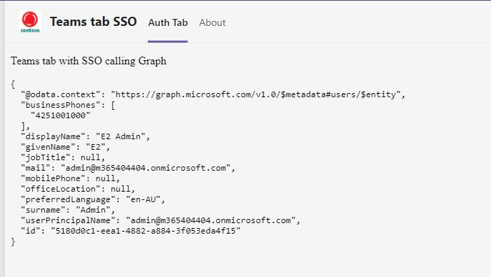

# sso-teams-js
Simplest of solution out there to show SSO in Teams tab.


## Minimal path to awesomeness

- Register an AAD app as per this [instruction](https://docs.microsoft.com/en-us/microsoftteams/platform/tabs/how-to/authentication/auth-aad-sso#1-create-your-aad-application) but in Step 3 choose multitenant account type.
- rename `env_Sample` to `.env` and copy the client id and secret of the app created in previous step into this variables.

- tunnel port 8080 and copy the [ngrok](https://ngrok.com/) url.
- update manifest file and update the tab's contentUrl property under `staticTabs`as `<ngrokurl>/sso`.
- update below properties in manifest file
```json
"webApplicationInfo": {
  "id": "00000000-0000-0000-0000-000000000000",
  "resource": "api://ngrokdomain/00000000-0000-0000-0000-000000000000"
}
```
where **id** is the client ID of the application and the **resource** is the domain of the ngrok URL and the id.
- package the app, which is basically zip the contents in the `manifest` folder and upload the app in `Teams app catalog`.
- from the root of the project run below commands to install dependencies (one time) and then start the service locally.

```nodejs
npm i
npm start
```



